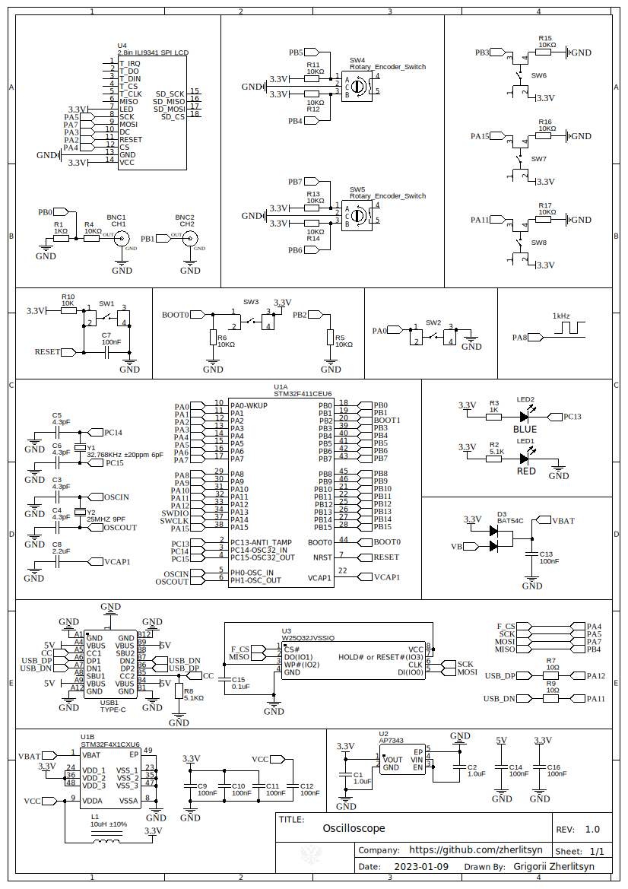

# Oscilloscope
[RU](README-ru.md "RU") [EN](README.md "EN")

Implementation of a simple oscilloscope based on the STM32F411CEU6 microcontroller. The oscilloscope is not designed for high-frequency measurements. The project was developed in order to familiarize with the STM32 platform. The presented functionality:
-  Synchronization using a rising/falling edge trigger.
- Two channels for signal measurement.
- One channel has a voltage divider with a ratio of 1:11 (therefore it has less accuracy).
- The second channel without a voltage divider.
- The bandwidth is approximately 1 MHz.
- Vertical sensitivity 20 mV.
- Input impedance 50 kΩ.

It is not possible for me to measure the sampling rate.

### Circuit diagram:

### Prototype on the breadboard:

